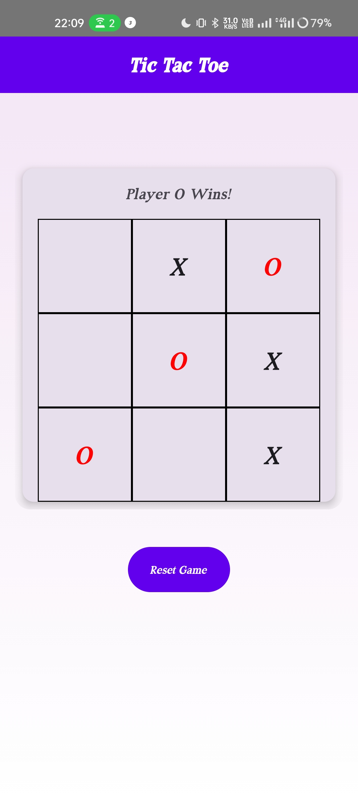

---

# Tic Tac Toe Android App 🕹️  

A simple **Tic Tac Toe** game developed using **Jetpack Compose** in **Kotlin**. Play against a friend in this classic 3x3 grid game with clean UI and intuitive gameplay.

## Features:
- **Two-Player Mode:** Alternate turns between Player X and Player O.
- **Win Detection:** Automatically highlights the winning combination.
- **Draw Detection:** Identifies and declares a draw when all cells are filled.
- **Game Reset:** Restart the game anytime with a single click.
- **Minimalistic UI:** Built using Jetpack Compose for a smooth and responsive design.

## Technical Details:
- **Tech Stack:** Kotlin, Jetpack Compose.
- **Minimum SDK:** Android 7.0 (API 24).
- **Architecture:** Simple logic encapsulated for easy understanding and expansion.

## Installation:
1. Clone the repository:
   ```bash
   git clone https://github.com/abhishek-maurya576/Tic-Tac-Toe.git
   ```
2. Open the project in **Android Studio**.
3. Build and run the app on an emulator or a physical device.

## Screenshots:




## License:
This project is licensed under the [MIT License](LICENSE).

Feel free to explore, use, and contribute to this project! 😊

---

